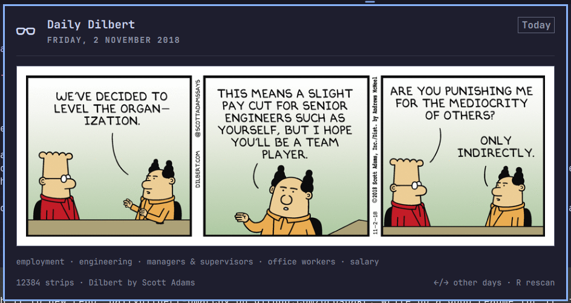

# DailyDilbert — a daily Dilbert strip for the Omarchy bar

An [Omarchy](https://omarchy.org/) shell bar widget that shows one Dilbert
strip per day from a local unpacked archive. A 󰊪 pill sits in the status
bar; clicking it opens a panel with today's strip.



## Features

- **One strip per day, deterministically** — the strip is chosen by
  hashing the local calendar date (`yyyy-MM-dd`, djb2 + a murmur-style
  finalizer) into the sorted file list. No state file, no randomness:
  two machines pointed at identical copies of the archive show the same
  strip on the same day. The finalizer matters — bare djb2 maps
  consecutive dates to consecutive indices, which would replay the
  chronologically-sorted archive in order.
- **Locale- and location-proof** — the file list is sorted with a plain
  code-unit comparator and paths are taken relative to the archive root
  (`find -printf '%P\n'`), so neither locale collation nor where the
  archive lives can change the pick.
- **Filename metadata** — files named `1997-03-14_keyword_keyword.gif`
  get their original run date in the header and the keywords as a
  caption under the strip.
- **Time travel** — arrow keys browse what the widget showed (or will
  show) on neighbouring days; reopening the panel always returns to
  today. The strip also rolls over automatically at midnight.
- **Search** — `/` reveals a field that matches keywords and dates
  against the filenames (all whitespace-separated tokens must match, so
  `coffee meeting` narrows and `1998-03` picks a month). The highlighted
  result is previewed live in the panel — arrow through the matches and
  the strip, date and caption follow — and Esc reverts to whatever was
  showing before. Pick a result and it replaces the day's strip until
  you press `T`.
- **Copy to clipboard** — `C` puts the strip on the Wayland clipboard as
  a PNG (the GIF's first frame), which is what other applications
  actually accept on paste.

## Interactions

| Input | Action |
|---|---|
| Left-click pill | Toggle panel |
| `←` / `→` | Show neighbouring days' picks |
| `T` / Enter / click strip | Back to today |
| `C` / 󰆏 button | Copy the displayed strip to the clipboard as PNG |
| `/` / 󰍉 button | Reveal the search field |
| `↑` / `↓` / hover (search) | Move through the results, previewing each |
| Enter (search) | Keep the previewed result |
| Esc (search) | Clear the query, close the field, revert the preview |
| Middle-click pill / `R` | Rescan the archive |
| Esc | Close panel |
| Tab / Shift-Tab | Switch to adjacent bar panels |

Copying needs `wl-clipboard` (`wl-copy`) and `imagemagick` (`magick`)
on `PATH`; without ImageMagick the raw GIF is put on the clipboard
instead.

## Install

The directory name must match the plugin id (`andrew.daily-dilbert`):

```bash
git clone https://github.com/orospakr/dailydilbert-omarchy.git ~/.config/omarchy/plugins/andrew.daily-dilbert
omarchy plugin enable andrew.daily-dilbert --section center
```

Put (or symlink) your comic archive at `~/.local/share/dilbert`. Any tree
of `.gif`/`.png`/`.jpg`/`.jpeg`/`.webp` files under that directory works;
subdirectories (e.g. one per year) are fine. Symlinks are followed.

## Configuration

Settings go on the widget's layout entry in `~/.config/omarchy/shell.json`.
All keys are optional; defaults shown:

```json
{
  "id": "andrew.daily-dilbert",
  "comicsDir": "~/.local/share/dilbert",
  "icon": "󰊪"
}
```

- `comicsDir` — root of the comic archive.
- `icon` — the glyph shown in the bar pill.

## How it works

The panel is a Quickshell/QML component following the Omarchy shell's
`bar-widget` plugin contract (`manifest.json` + `BarWidget.qml` +
`Panel.qml`, modelled on the built-in `omarchy.weather` plugin). At
startup a `find` process (spawned directly, no shell) lists the archive
once; everything after that is pure QML — the day's file is picked by
hash and displayed with a plain `Image` off the filesystem.

Dilbert is by Scott Adams; this widget just displays a library you
already have locally and is not affiliated with him or his syndicate.
